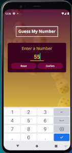
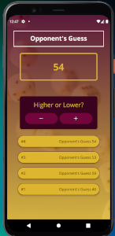
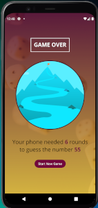

    <h3 align="center">Guess The Number Mobile App</h3>

## License

## Description

This app is a game that allows the user to select a number and the mobile devvide will try to guess the number. Each time the device makes an incorrect guess the user will indicate if the next guess should be higher or lower.

If the next guess should be higher and the user selects lower an alert will appear telling the user not to lie. The round number and device's guesses are displayed and when the device gets the correct number a new screen is displayed with the user's number and the number of rounds it took for the device to get the correct number.

There is also a 'Start New Game' button.

## Table of Contents

- [License](#license)
- [Description](#description)
- [Table of Contents](#table-of-contents)
- [Installation Instructions](#installation-instructions)
- [Usage](#usage)
- [Contributors](#contributors)
- [Testing](#testing)
- [Questions](#questions)

  
(<a href="#top">back to top</a>)

## Installation Instructions

  <ul>
    <li>Clone this repo by entering the folling command from the command prompt: <code>https://github.com/judo2000/react-native_guess_number.git</code></li><li>Change into the new director: <code>cd react-native_guess_number</code></li>
    <li>From the command prompt, enter: <code>npm i</code> to install all necessary packages</li>
  </ul>
  
  
(<a href="#top">back to top</a>)

  
  ## Usage

This app is not deployed as it is a mobile app. To view it you will need to install the Expo Go app to your device or download the Android Studio app to your computer to view it on an Android simulator. From the terminal screen in your IDE, run <code>npm start</code>. From there you will see a QR Code that you can scan from your mobile device or if you are using the Android simulator you can just press <code>a</code> from the terminal after running <code>npm start</code>.

Once running you can click the 'Add New Goal' button and a modal will slide up. Enter your goal and click 'Add Goal'. The modal will slide out and the new goal will appear on the home screen. To delete a goal, simply tap it and it will be deleted.

  
(<a href="#top">back to top</a>)

  
    
  ## Contributors
  NA

  
(<a href="#top">back to top</a>)

## Testing

NA

  
(<a href="#top">back to top</a>)

## Questions

<a class="hoverable" href="https://linktr.ee/stephensmoore" target="_blank">Stephen Moore</a>

  
(<a href="#top">back to top</a>)

